# clickhouse-odbc-rpm
RPM build script for clickhouse-odbc

# Ready-to-use RPMs
In case you'd like to just get ready RPMs look into [this repo](https://packagecloud.io/Altinity/clickhouse)

# Build RPMs
In most cases just run `./build.sh all`

# ODBC configuration
```bash
vim ~/.odbc.ini:
```
```ini
[ClickHouse]
Driver =  /usr/local/lib64/odbc/libclickhouseodbc.so
# Optional settings:
#Description = ClickHouse driver
#server = localhost
#database = default
#uid = default
#port = 8123
#sslmode = require
```

# Testing
Run
```bash
isql -v ClickHouse
```

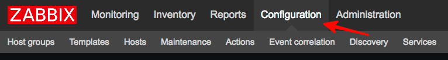
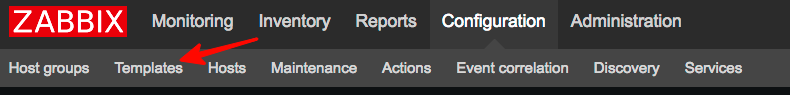
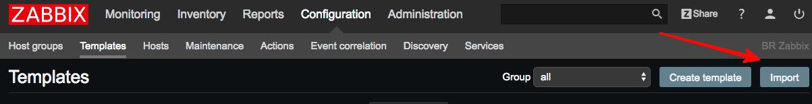
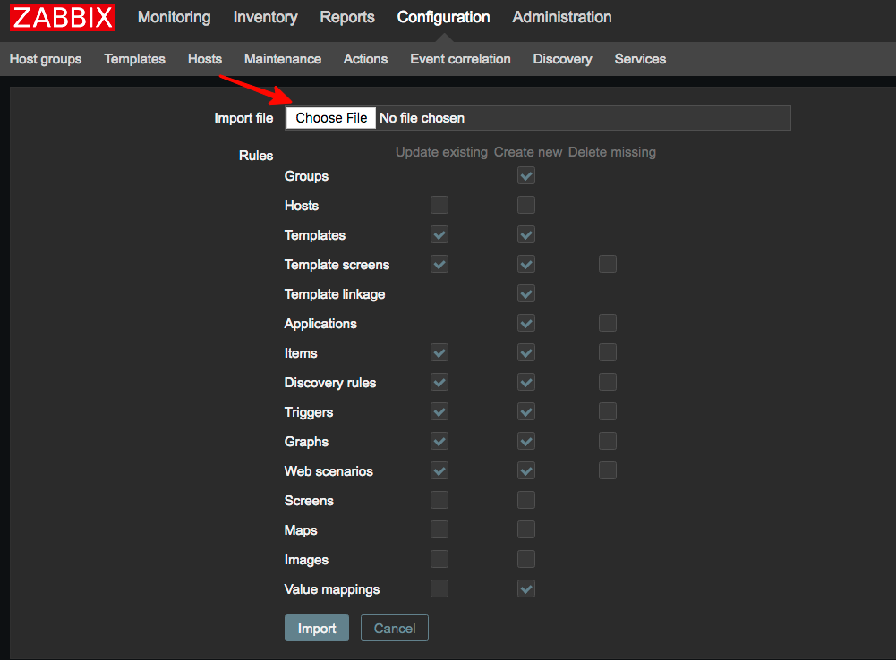
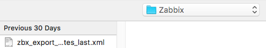
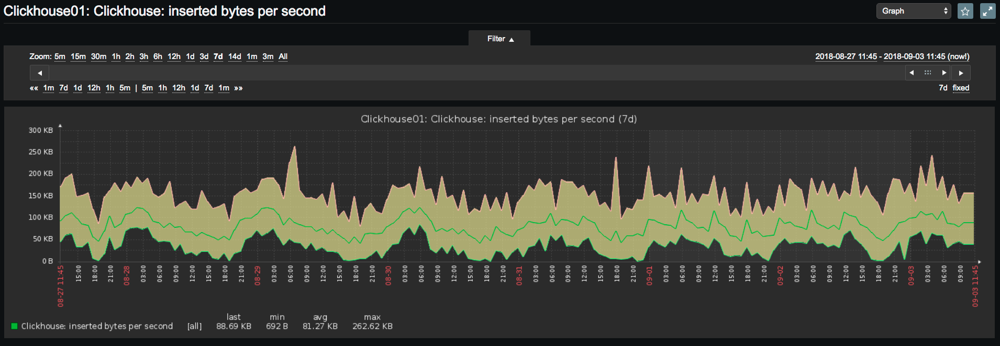
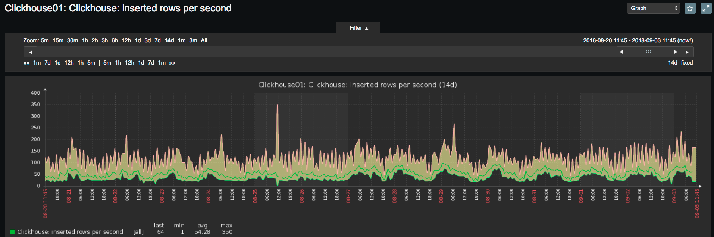
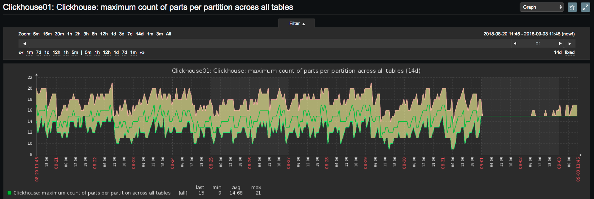
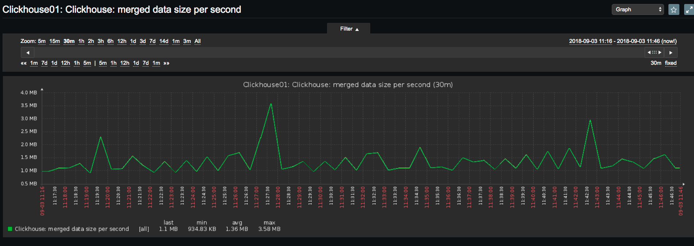
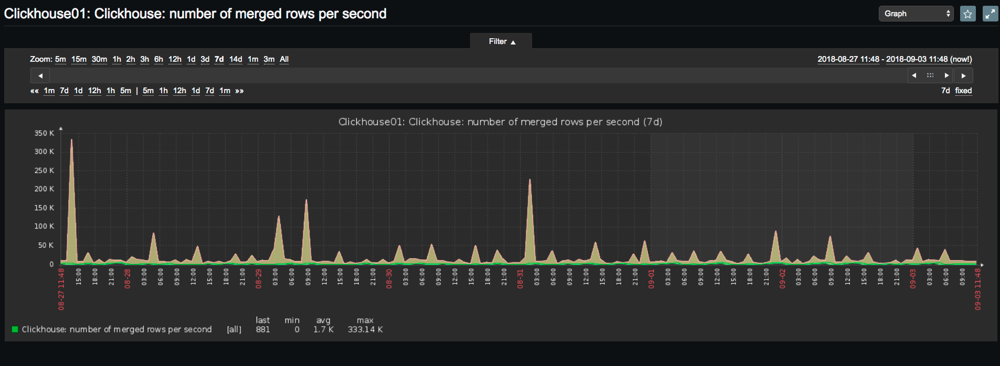
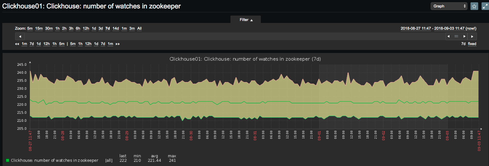

